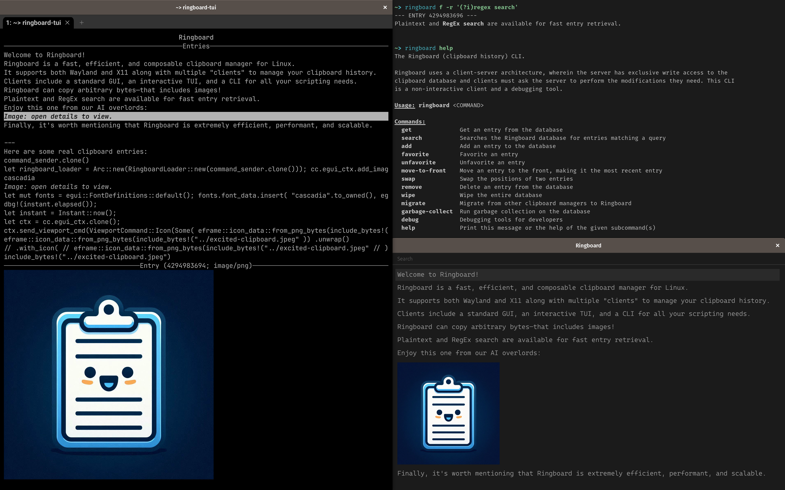

# Ringboard

Ringboard is a fast, efficient, and composable clipboard manager for Linux.

Basic features:

- Ringboard **remembers what you've copied** across reboots.
- Ringboard can **save anything**, including **images** or arbitrary bytes.
- Your clipboard history is **searchable** with either **Regex** or raw queries.
- Ringboard can be **installed anywhere** (on Linux) and has no ties to a specific desktop
  environment or framework.

Differentiators:

- Ringboard is **efficient**: it uses a custom binary format to save space on disk, io_uring to
  avoid allocations and be fast with just a single thread, and mmap to require minimal working set
  memory.
- Ringboard is **fast** and **scalable**: it was architected to load only the data needed, when
  needed. For example, displaying the last 100 most recent clipboard entries requires loading just
  those 100 entries. Ringboard can support up to **~1 million saved clipboard entries**. If you
  copied 100 things every day, it would still take almost 30 years before old entries are
  overwritten.
- Ringboard is **composable**: it uses a client server architecture to support any app modifying or
  reading data. For example, you can add data via a CLI or an X11 or Wayland clipboard watcher.
  Different GUIs can each display the clipboard as they wish, enabling deep integration with desktop
  environments.

A detailed technical breakdown of the project is available at https://alexsaveau.dev/blog/ringboard.

## Demo



## Installation instructions

> Note: Ringboard is Linux-only and requires a relatively recent Kernel (6+).

The easiest way to get going is to
[install cargo](https://doc.rust-lang.org/cargo/getting-started/installation.html) with nightly and
then run the installation script for systemd:

```sh
rustup install nightly # If not already installed
curl -s https://raw.githubusercontent.com/SUPERCILEX/clipboard-history/master/install-with-cargo-systemd.sh | bash
```

Additionally, consider using https://github.com/nabijaczleweli/cargo-update to update your cargo
apps or re-run the installation script whenever you need to update.

### Manual installation

#### Common core

You'll need the server, an X11 or Wayland clipboard watcher, and a way to view your clipboard:

1. Install the server from source with
   `cargo install clipboard-history-server --no-default-features --features systemd` or download a
   [prebuilt binary](https://github.com/SUPERCILEX/clipboard-history/releases/latest).
2. Determine whether you are using Wayland or X11 with `bash -c 'echo $XDG_SESSION_TYPE'`:
   1. If on Wayland, install from source with
      `cargo install clipboard-history-wayland --no-default-features` (prebuild binaries are also
      available as before).
   2. If on X11, install from source with
      `cargo install clipboard-history-x11 --no-default-features`.
3. Install a client of your choice:
   - egui: `cargo install clipboard-history-egui --no-default-features --features wayland/x11`
   - ratatui: `cargo install clipboard-history-tui`
   - CLI: `cargo install clipboard-history`
4. Add a
   [custom shortcut](https://help.gnome.org/users/gnome-help/stable/keyboard-shortcuts-set.html.en)
   to start your GUI. See the [`egui` docs](egui#suggested-workflow) for example.

#### For systemd

Install the [server](server/ringboard-server.service) and [X11](x11/ringboard-x11.service) or
[Wayland](wayland/ringboard-wayland.service) services into `~/.config/systemd/user` and enable them:
`systemctl --user enable ringboard-{wayland,x11}`.

#### For framework-less systems

You'll need to start the Ringboard server and X11/Wayland clipboard watcher on boot.

### Uninstalling

Run

```sh
curl -s https://raw.githubusercontent.com/SUPERCILEX/clipboard-history/master/uninstall.sh | bash
```

## Migrating from existing clipboard managers

Tooling is provided to migrate from other clipboard managers. Run:

- `$ ringboard migrate gch` to import your
  [Gnome Clipboard History](https://github.com/SUPERCILEX/gnome-clipboard-history) entries.
- `$ ringboard migrate g-paste` to import your [GPaste](https://github.com/Keruspe/GPaste) history.
- `$ ringboard migrate clipboard-indicator` to import your
  [Clipboard Indicator](https://extensions.gnome.org/extension/779/clipboard-indicator/) history.

## Project breakdown

Each submodule contains its own README with details on the submodule.

- `/`
  - [`cli/`](cli): The Ringboard Command Line Interface contains tools for working with the
    Ringboard database.
  - [`client-sdk/`](client-sdk): The client SDK offers APIs to read and write Ringboard data.
  - [`core/`](core): The core code shared across many Ringboard crates.
  - [`egui/`](egui): The egui Ringboard client displays clipboard entries in a standard GUI.
  - [`server/`](server): The Ringboard server writes data to the Ringboard database.
  - [`tui/`](tui): The ratatui Ringboard client displays clipboard entries in your terminal.
  - [`wayland/`](wayland): The Wayland clipboard watcher sends new clipboard entries to the
    Ringboard server.
  - [`x11/`](x11): The X11 clipboard watcher sends new clipboard entries to the Ringboard server.
